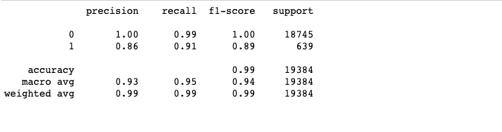
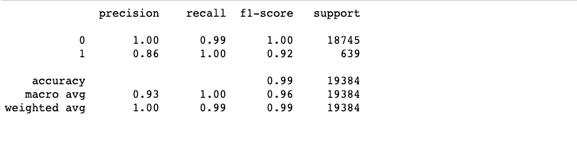

# credit-risk-classification

## Background
In this Challenge, you’ll use various techniques to train and evaluate a model based on loan risk. You’ll use a dataset of historical lending activity from a peer-to-peer lending services company to build a model that can identify the creditworthiness of borrowers.

1. Split the Data into Training and Testing Sets

2. Create a Logistic Regression Model with the Original Data

3. Write a Credit Risk Analysis Report

## Results

### Logistic Regression Model with the Original Data

### Logistic Regression Model with Resampled Training Data

## References

* [Balanced Accuracy: When Should You Use It?](https://neptune.ai/blog/balanced-accuracy)

* Data for this dataset was generated by edX Boot Camps LLC, and is intended for educational purposes only.